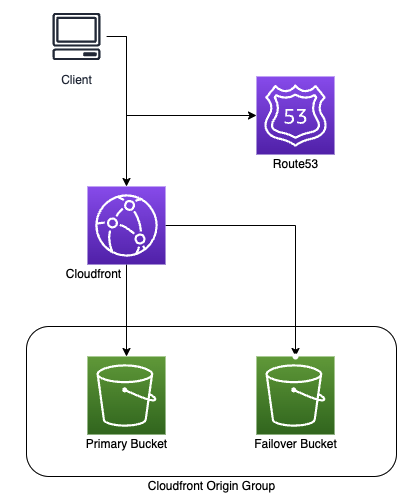

# S3 Static Website Terraform Template
This terraform template will create all infrastructure necessary to run an AWS S3 static website. Below are the pre-requisites, the configurable variables, and the resources it will create.
This is a public module published to the Terraform registry: https://registry.terraform.io/modules/cullancarey/static-s3-website-template/aws/latest

### Pre-requistes
1. An AWS account with admin access or specific access to relevant services listed in Resources below. 
2. Terraform installed. See https://learn.hashicorp.com/tutorials/terraform/install-cli for details.
3. A public hosted zone that will be used for the website. This zone **must** be named the same name as the website. For example, my website is cullancarey.com, so my hosted zone is named cullancarey.com. 
	- **NOTE:** If you register your domain within Route53, there will be an option to create a hosted zone from the newly registerd domain. I recommend you use this option, especially if you do not understand DNS functionality.

### Variables
1. root_domain_name
	- Type: string
	- Description: The domain name of your website.
2. website-bucket-region
	- Type: string
	- Description: The primary region where your website will be hosted.
3. backup-website-bucket-region
	- Type: string
	- Description: The region where your backup bucket will be located.
4. cloudfront_price_class
	- Type: string
	- Description: The price class for the Cloudfront distribution. Valid entries are PriceClass_All, PriceClass_200, or PriceClass_100.
	- Default: PriceClass_100

### Resources

#### Primary S3 Bucket
A S3 bucket to act as the primary bucket for hosting the website.

#### Failover S3 bucket
A S3 bucket in a different region for failover purposes.

#### Cloudfront Distribution
A Cloudfront distribution to cache static files at the edge and help with performance of your website. It creates an origin group which includes the primary and failover S3 website buckets. It is configured to use an OAI to access the S3 buckets. It will be configured to your main domain name (ex: cullancarey.com) and a sub-domain name (ex: www.cullancarey.com).

#### AWS ACM Certificate
A ACM certificate that is used by Cloudfront. This allows for the website to be securly accessed over SSL/TLS.

#### Route53 Records
Route53 records including the Cloudfront distribution and the ACM validation records.

